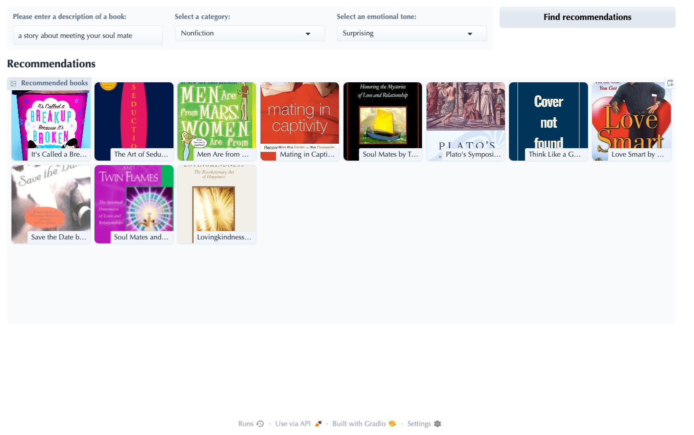

# Semantic Book Advisor

*Like TripAdvisor... but for books!*

I built this project to learn how natural language processing works. This app combines LLM embeddings, vector search, and sentiment analysis into an interactive recommendation engine that understands the **meaning** behind your request, not just keywords.

Instead of searching by title or genre, you type something like *"a book about a person seeking revenge"* or *"something joyful and uplifting"*, and the app returns books that match — visually, emotionally, and thematically.

## How it works

- **Semantic search** — Book descriptions are embedded using OpenAI/HuggingFace models and stored in a Chroma vector database, enabling natural-language queries to retrieve the most contextually relevant books.
- **Zero-shot classification** — Books are automatically tagged as fiction or non-fiction using pretrained transformer models, giving users a filterable facet without manual labeling.
- **Sentiment & emotion analysis** — Each book's tone (suspenseful, joyful, sad, etc.) is extracted using LLM-based sentiment analysis, letting users sort recommendations by mood.
- **Interactive UI** — A clean, responsive Gradio web app ties it all together, letting users query, filter, and browse book covers in real time.

## Tech stack

Python · LangChain · Chroma · OpenAI & HuggingFace embeddings · Transformers (zero-shot classification, sentiment analysis) · Gradio

  

